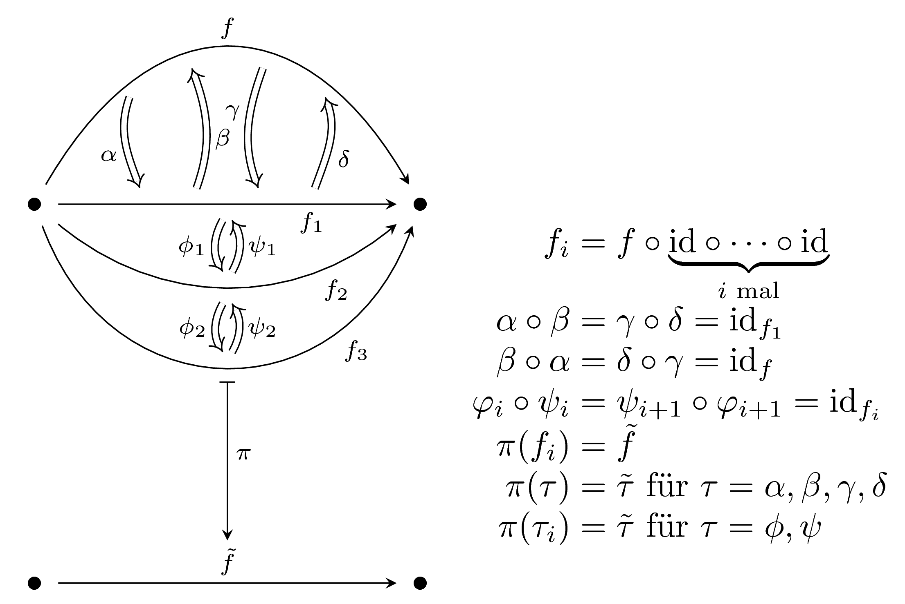

# Study Group: Higher-Categories
Dieses Repository dient zur Organisation einer Study Group zur Kategorientheorie.

Der Termin wurde über folgendes Doodle ausgemacht: [Link](https://doodle.com/poll/fi3pgxm5zwe2yzre).

Wir haben uns auf folgenden Termin geeinigt: **Freitags, von 12:15 bis ca. 14:00**.

Wir treffen uns auf der Morgenstelle im **Raum S10** im Mathebau. Es ist genug Zeit davor ab 11:30 in der Mensa zu essen.

## Materialien

* John Baez, An Introduction to n-Categories [Link](https://arxiv.org/abs/q-alg/9705009)
* Eugenia Cheng, Aaron Lauda, Higher-Dimensional Categories, an illustrated guide book [Link](http://cheng.staff.shef.ac.uk/guidebook/index.html)
* Tom Leinster, Higher Operads, Higher Categories [Link](https://arxiv.org/abs/math/0305049)
* Tom Leinster, A Survey of Definitions of n-Category [Link](https://arxiv.org/abs/math/0107188)

## Termine

### 23.2.2018

Wir treffen uns um 12:15 an der Infobox in der Mensa und gehen dann zum Raum S10 den Tim reserviert hat. Wir lesen den Artikel von John Baez.

### 2.3.2018

Wir treffen uns im Raum S10 und lesen Kapitel 1 + 2 aus dem Buch von Cheng und Lauda. Kapitel 1 ist eine generelle Einführung und Kapitel 2 behandelt die Definition von Penon.

### 9.3.2018

Wir besprechen erneut die Definition von Penon (Kapitel 2) aus dem Buch von Cheng + Lauda. Da wir letzte Woche festgestellt haben dass die dortige Definition nicht ganz formal ist lesen wir zusätzlich die formale Definition (Definition P) auf Seiten 14 bis 17 aus dem Überblicksartikel von Leinster. (Link ist oben unter den Materialien)

### 16.3.2018

Wir besprechen die Definition(en) von Batanin und Leinster. In dem Artikel von Leinster entspricht das den Definitionen B, L und L' (p. 18 – 30). Im Buch von Cheng und Lauda entspricht das dem Kapitel 3 (p. 25 – 50). Paul wird den Inhalt vorbereiten und an der Tafel präsentieren.

### 23.3.2018

Da sich die Besprechung der Batanin-Definition als länger als geplant herausgestellt hat, besprechen wir sie diese Woche erneut.

### 30.3.2018

Karfreitag, es findet keine Besprechung statt.

### 06.4.2018

Wir lesen die opetope-Definition, also Definition X im Artikel von Leinster und Kapitel 4 im Buch von Cheng und Lauda. Präsentieren wird Ingo.

## Bemerkungen

Zum Unterschied Q – Algebren in Penon:
Angenommen, wir hätten ein Magma mit zwei 0-Zellen (1 und 2) auf denen es jeweils nur die Identitäts-1-Zellen id gibt.
Außerdem gibt es eine 1-Zelle  von 1 nach 2, sowie alle Kompositionen

(die Kompositionen  sind strikt)
Außerdem gibt es die 2-Zellen  sowie deren Komposite wie unten im Bild angegeben, wobei alle Gleichungen strikt gelten.
Alle höheren Zellen sind trivial.
Des weiteren gibt es eine strikte -Kategorie mit den gleichen 0-Zellen, den beiden Identitäts-1-Zellen sowie der 1-Zelle  und den 2-Zellen  auf  mit den Gleichungen

sowie allen Kompositen.
Auch hier sind alle höheren Zellen trivial.
Nun gibt es zwei Möglichkeiten,  zu wählen, entweder  oder .
Sei nun A die schwache -Kategorie, die  als Kontraktion besitzt, während bei C entsprechend  als Kontraktion gewählt wurde.
Als Kategorien sind diese beiden Äquivalent, es gibt also unter anderem zwei Morphismen von A nach C: Die Identität und den Morphismus , der die Paare  und  (und natürlich die entsprechenden höheren Zellen) vertauscht.
Wenn man die beiden nun allerdings als Kontraktionen versteht, ist die Identität kein gültiger Morphismus, denn es gilt

.

